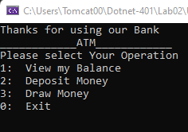

# Lab02
This is project is bank “ATM” program within a console application

You can use this application to :
  1- Check your balance 
  2- Deposit amount of money but if you entered a negative number will not affect your balance
  3- Drow money but you cant drow a negative amount
  4- and you cant drow amount greater than your balance

## Images from Application 
### The startup

### View balance

### Deposit amount of money

### Drow amount of money

### Exiting the application

